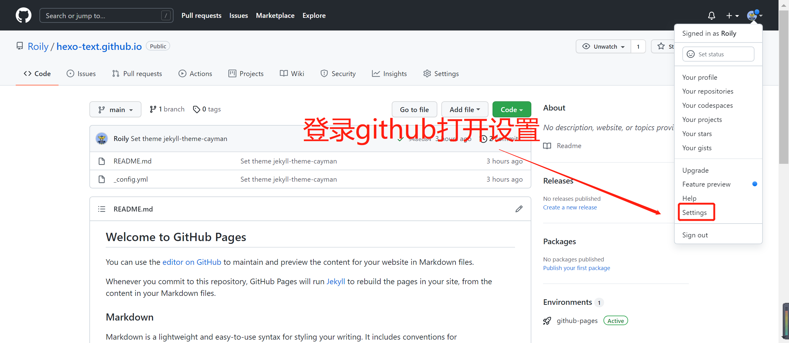

## Hexo介绍
Hexo 是一个快速、简洁且高效的博客框架。Hexo 使用 Markdown（或其他渲染引擎）解析文章，在几秒内，即可利用靓丽的主题生成静态网页。

- 风一般的速度 
Hexo基于Node.js，支持多进程，几百篇文章也可以秒生成。 
- 流畅的撰写 
支持GitHub Flavored Markdown和所有Octopress的插件。 
- 扩展性 
Hexo支持EJS、Swig和Stylus。通过插件支持Haml、Jade和Less.

## 搭建准备
- 所需环境
  - [Node.js](http://nodejs.cn/api/ "Nodejsの中文镜像网站")
  - [git](https://git-scm.com/ "git官网")
- 所需工具
  - [github](https://github.com/ "最大的同性交友网站")
  - [hexo](https://hexo.io/zh-cn/ "hexo中文官网")

## 开始搭建

 
  
   fist-step 

<ul class="nano-ul-flex">
  <li>
    
安装hexo脚手架

    
npm install -g hexo-cli

    

  </li>
   <li>
    
初始化hexo文件夹

    
hexo init (初始化hexo)

    
npm install

    

    
    
Tips: 如果出现报错,一般都是node版本过低导致,升级一下node版本就可以了(博主的node版本是v14.18.1)

    

  </li>
  <li>
    
本地启动hexo

    
hexo g (生成hexo)

    
hexo s (启动本地服务器,这一步之后就可以通过http://localhost:4000 查看)

    
    
&nbsp;

    
    

    
    这样就暂时先完成了本地博客的环境搭建啦~

    
Tips: 如果出现端口占用问题可以输入
      hexo s -p 41
      暂时切换端口
    

    

  </li>
</ul> 

 
  
   twice-step 

<ul class="nano-ul-flex">
  <li>
    <a href="https://github.com/">创建github账号</a>
  </li>
  <li>
   创建一个新的github仓库
   
   

   
    

    
    

      
    这样就完成了github的环境配置了~

  </li>
</ul>

 
  
   third-step 

<ul class="nano-ul-flex">
  <li>
    
配置本地hexo部署到GitHub的文件

    

      编辑根目录下_config.yml文件,查找并切换到deploy字段位置,如图进行编辑:
    

    
    

      保存后安装扩展: npm install hexo-deployer-git --save   
    

    
Tips: hexo的语法规定  : 后面
      必须有一个空格
    

    

  </li>
  <li>
    
配置SSH Key 到GitHub

    

      
在Git Bash中输入: ssh-keygen -t rsa -C "你的github邮箱号"  

      
之后按三下回车出现以下内容

      
    

    

    

      
找到.ssh文件夹，并打开其中的id_rsa.pub文件，复制里面的内容

      
    

    

    

      
之后按下面图片步骤执行

      
      

      
       

      
      

      
      

      
      

      
此时在git bush中输入 ssh -T git@github.com

      
      

      
    如果出现了以上语句,则说明设置成功~

    

    

  </li>
   <li>
    
推送本地hexo 到GitHub

    

      
在Git Bash中设置用户信息:

      
      

      
编辑根目录下_config.yml文件,查找并切换到url字段位置,如图进行编辑:

      
      
Tips:   配置之后,初次上传就可以有样式了~ 
      

      

    

  </li>
</ul> 

## 搭建完成

 
  
   last-step 

<ul class="nano-ul-flex">
  <li>
    输入 hexo d 指令推送到远端
    
    
Tips:   网络原因可能会推送不成功,多试几下就好了~ 
    

    

  </li>
   <li>
    推送成功!
    
    

    
     
Tips:   因为picGo一直推不上去pc端的界面截图,所以展示了移动端的效果~ 
    

     

  </li>
  

    
    这样就完成了博客的搭建与上传~

</ul> 

## 最后の一些话
- 附上一些其它常用指令  
 

- 其它念叨  
  - 之后也会陆续推出使用picgo搭配gitee做的图床教程,主要是为了减少静态资源的体积,本文的所有图片均来自gitee创建的图床~
  - 一开始不用gitee而选择github的原因是因为gitee的pages服务需要人工审核,审了我蛮久的,github不需要审核,就是需要科学上网,所以gitee也是可以做博客的,有兴趣的同学可以自己尝试一下~
  - hexo还有主题这些,后面也会出一些教程,毕竟我也才开始弄hexo,也不是很会,可能只会写一些很浅显的东西- -
  - 纪念第一篇博文,完结撒花,我去推了 2021-11-26
